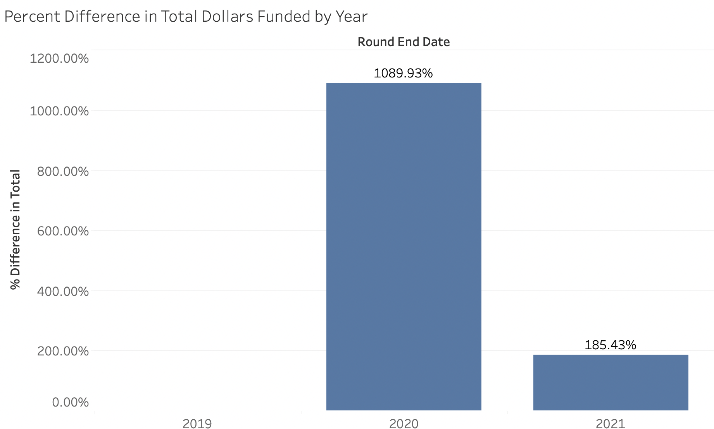

# 2021 Year-End Gitcoin Grants Trends 

Gitcoin grants is an innovative, principled experiment in new ways to fund open source software projects and public goods. It seeks to find new and better ways to crowdfund which rewards projects that appeal to more people rather than to merely rich people.
The main driver of this project is a system called 'quadratic funding' which is best explained at [wtfisqf.com](https://wtfisqf.com/)

Quadratic funding seeks to provide projects more funding if they have more unique contributors. In other words: more people, more money. 
Gitcoin accomplishes this by having a supply of money called a 'matching fund' for each funding cycle or grant round. Money from this matching fund is paid to grants by Gitcoin proportional to the number of unique contributors of the grant.
So far, Gitcoin has been funding projects for 3 years and in that time has had 12 rounds of funding.

## 20x in 2 years
The growth of Gitcoin grants is truly impressive! Since 2019, Gitcoin has 20x'd its impact. 20x in two years. 

Let's take a look at the numbers:

From 2019 to 2020 the number of grants 10x'd. From 2020 to 2021 the number of grants 2x'd. Put together, this is 20x in two years. I am rounding the numbers here to pick out the big trends in the gitcoin grants system. As with any system, there is immense variability if one gets increasingly granular.

This is just the number of grants on the platform, created by users. But what about the amount of **money** that was actually paid out to projects?

This story is even more impressive. Once again, there is roughly a 10x improvement between 2019 and 2020 (closer to 11x). There is a roughly 2x improvement between 2020 and 2021 (closer to 3x).

At *least* 20x in 2 years.

## Quadratic Funding 

Quadratic funding works through having two types of funds:
- Crowdfunded Funds (from direct contributions, just like on kickstarter or gofundme) 
- Matching Funds (from Gitcoin, based on the number of unique contributors to a grant)

How well has Quadratic Funding been working to get more money to projects that are supported by more people? The results are promising although not completely clear. 

Let's take a look at how much in funding projects recieved on Gitcoin from Crowdfunding:

The big take-aways are that most projects recieved less than 100k in funding but a few projects recieved more. As the number of contributors increases, the amount of crowdfunding increases linearly.

Let's take a look at how much in funding projects recieved on Gitcoin from Matching Funds: 

Once again, most projects recieve less than 100k in funding but a few recieved more. The points on this graph are dispersed a bit higher. If we pay particularly close attention to the bottom of the spread and scan from left to right, the trend does *not* look linear.
The trend looks exponential or *quadratic*. 

Note: Interestingly, in both graphs you'll notice a strong outlier (the gray circle at the top). This is a grant titled [Coin Center is educating policy makers about public blockchains](https://gitcoin.co/grants/1668/coin-center-is-educating-policy-makers-about-publ). The reason for it's prominence is not clear to me. 

While it is still early days for quadratic funding, the *growth* of the platform and it's implementation is truly impressive. 

## Matching Funds

As of 2021, not everyone automatically recieves matching funds. Projects which do not have enough contributors or contributions do not get matching funds. The matching funds operate like a shared communitty resource. This system may work to ensure the money is spent where the communitty wants it to be spent. 

For the grants that did not recieve matching funds in 2021, what was the threshold? We can try to find a rough rule of thumb by zooming into those grants and checking how many contributors and contributions they had.

Based on these graphs, as a very general rule of thumb it seems a project should aim to have at least:
- 4+ unique contributors
- 100 USD + in crowdfunded contributions to recieve matching funds
- Note: this is a rule of thumb based on the dataset, and not a hard-coded requirement 

This opens the door to matching funds but this is only sufficient to get ones foot in the door. For example, in Gitcoin Grants Round 12 my grant submission [braid.science](https://gitcoin.co/grants/4097/braidscience) recieved $166.39 by crowdfunding from 8 contributors and an addittional $0.20 in matching funds.
On the other hand, in the same round, Coin Center raised $103,838.93 from 5727 contributors and recieved $340,000.00 in matching funds.
Also in the same round, the Electronic Frontier Foundation raised $58,715.04 from 3331 and recieved $228,273.84 in matching funds. 

The power of matching funds when applied using quadratic funding can be truly great. It serves as a mechanism to amplify popular proposals. Further, it gurantees that it is not empty popularity because the proposals which recieve matching funds must be ones people truly believe in. After all, crowdfunders had to put some of their own skin in the game: some of their own money towards the project.
